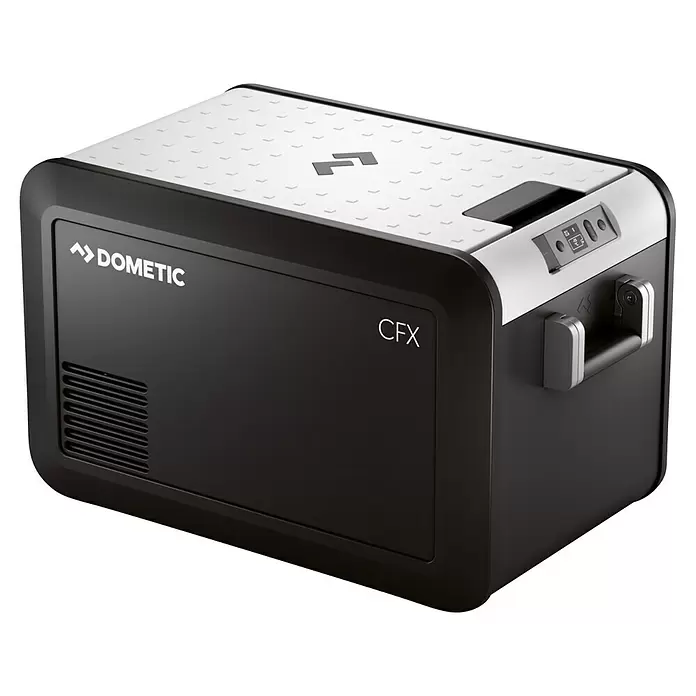

# Dometic CFX3 WiFi

<p align="center">
  
</p>

Home Assistant integration for Dometic CFX3 coolers using the local DDMP protocol.

[](https://www.home-assistant.io/)
[](https://hacs.xyz/)
[](#overview)
[](LICENSE)

## Overview

Dometic CFX3 WiFi is a custom Home Assistant integration for compatible Dometic CFX3 coolers. It communicates directly with a cooler over the local Wi-Fi network using the local DDMP protocol, without cloud connectivity or third-party account credentials.

The integration was initially developed and tested with a **Dometic CFX3 35**. Other Dometic CFX3 models may work if they expose the same local DDMP interface, but they should be treated as unverified until users report successful compatibility tests.

## Features

| Feature | Details |
| ------- | ------- |
| Local network communication | Polls the cooler directly over the local DDMP TCP connection; no cloud connection or account is used. |
| Setup flow | Adds the integration through the Home Assistant UI using either a configurable IPv4 network scan or manual IP-address entry. |
| Configurable TCP port | Uses TCP port `13142` by default and allows the port to be changed during setup. |
| Automatic rediscovery | When a discovery network was saved during setup, the integration can scan that network and reconnect by cooler-reported device name after a connection failure. |
| One-zone cooling control | Exposes one climate entity with the current temperature, a configurable target temperature from `-22 °C` to `10 °C`, and `cool`/`off` control. Dual-zone control is not implemented. |
| Power monitoring and control | Exposes the cooler power state and allows the cooler to be turned on or off. |
| Compressor monitoring | Reports whether the compressor is running. |
| Battery protection | Reports and selects `LOW`, `MED`, or `HIGH` battery-protection modes. |
| Power diagnostics | Reports battery voltage and whether the cooler is using mains AC or battery DC power. |
| Connection diagnostics | Reports the cooler-provided device name, current IP address, and time of the last successful communication. |
| Polling interval | Provides an integration option and configuration entity for a polling interval from `60` to `360` seconds. |

## Supported Devices

The integration was initially developed and tested with the **Dometic CFX3 35**. Other Dometic CFX3 coolers are expected to be candidates for compatibility if they expose the same local DDMP interface, but no additional models are presented as verified by this repository.

Please report successful compatibility tests and any model-specific issues through [GitHub Issues](https://github.com/JS-DE-Tech/hacs-dometic-cfx3/issues).

## Requirements

- Home Assistant `2025.1.0` or newer.
- A compatible Dometic CFX3 cooler with its Wi-Fi connection configured.
- Local network reachability from the Home Assistant host to the cooler.
- TCP access from Home Assistant to the cooler on port `13142`, unless a different port is explicitly selected during setup.
- An IPv4 network in CIDR notation for network-scan setup, or the cooler's IP address for manual setup.

## Installation

### Installation via HACS as a Custom Repository

1. Open HACS.
2. Open the integrations section.
3. Open the menu in the upper-right corner.
4. Select **Custom repositories**.
5. Add `https://github.com/JS-DE-Tech/hacs-dometic-cfx3` as the repository URL.
6. Select the category **Integration**.
7. Install the integration.
8. Restart Home Assistant if required.
9. Open **Settings → Devices & services → Add integration**.
10. Search for **Dometic CFX3**.

The HACS repository display name is **Dometic CFX3 WiFi**. Home Assistant presents the integration itself as **Dometic CFX3**.

### Manual Installation

1. Download or clone this repository.
2. Copy `custom_components/dometic_cfx3` into the Home Assistant configuration directory so that the installed component path is:

   ```text
   /config/custom_components/dometic_cfx3
   ```

3. Restart Home Assistant after copying or updating the integration manually.
4. Open **Settings → Devices & services → Add integration** and search for **Dometic CFX3**.

## Configuration

Add the integration from **Settings → Devices & services → Add integration** by searching for **Dometic CFX3**. The configuration flow provides two local setup modes:

- **Network scan:** Keep network scanning enabled and enter an IPv4 network in CIDR notation. The default is `10.100.3.0/24`. The integration probes that network locally and prompts you to select a cooler if it discovers more than one.
- **Manual setup:** Disable network scanning and enter the cooler's IP address.

TCP port `13142` is the default in both modes and can be changed during setup. Credentials are not requested. Home Assistant must be able to reach the cooler over the selected TCP port. After setup, the polling interval can be changed through the integration options or the polling-interval configuration entity.

## Available Entities

| Entity type | Purpose | Notes |
| ----------- | ------- | ----- |
| Climate | Cooling control | Reports the current and target temperatures; sets the target temperature; turns cooling on or off. |
| Switch | Cooler on/off | Explicit cooler power control. |
| Select | Battery protection | Selects `LOW`, `MED`, or `HIGH`. |
| Number | Polling interval | Configuration entity for a `60` to `360` second polling interval. |
| Binary sensor | Cooler status | Reports the cooler power state. |
| Binary sensor | Compressor status | Reports whether the compressor is running. |
| Sensor | Current temperature | Reports the measured cooler temperature. |
| Sensor | Target temperature | Reports the configured target temperature. |
| Sensor | Battery voltage | Reports measured battery voltage when the cooler provides a positive voltage value. |
| Sensor | Power source | Reports mains AC or battery DC operation when provided by the cooler. |
| Sensor | Device name | Reports the cooler-provided name. |
| Sensor | IP address | Reports the current cooler address used by the integration. |
| Sensor | Last communication | Reports the time of the last successful status update. |

## Troubleshooting

- **The cooler cannot be reached:** Confirm that its Wi-Fi setup is complete and that Home Assistant can reach the cooler's IP address on the configured TCP port. The default port is `13142`.
- **The cooler IP address changed:** The integration attempts to scan the network saved during setup and reconnect by cooler-reported device name after a connection failure. If that saved IPv4 CIDR no longer covers the cooler, remove and add the entry again with the correct network or current IP address.
- **Network scan finds no cooler:** Check the IPv4 CIDR value and confirm that the Home Assistant host and cooler are on mutually reachable networks. Network segmentation and firewall rules must allow the local TCP connection.
- **Connection fails after installation:** Confirm the selected IP address and port, then review the Home Assistant logs for messages from the `dometic_cfx3` integration.

## Support

If this project is useful to you, you can support its continued development and maintenance:

[](https://paypal.me/JensSaffrich)

## Contributing

Bug reports, compatibility reports for additional Dometic CFX3 models, and pull requests are welcome. Please use [GitHub Issues](https://github.com/JS-DE-Tech/hacs-dometic-cfx3/issues) for bugs and compatibility results.

## License

This project is available under the [MIT License](LICENSE).
